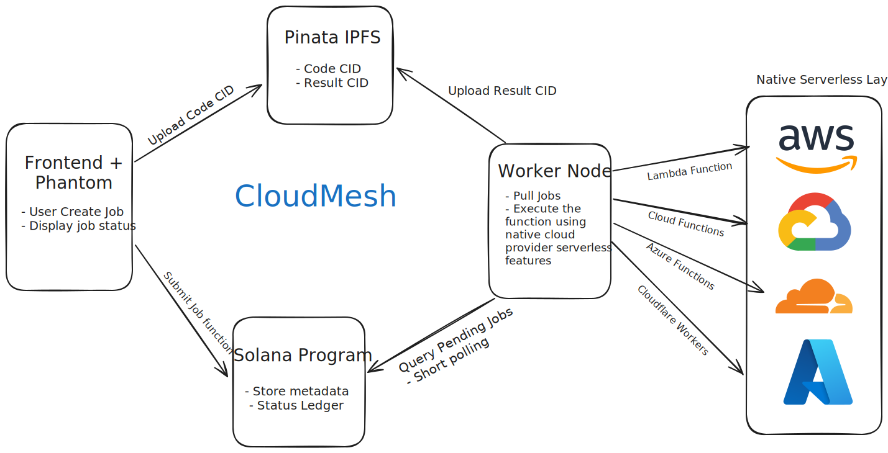

# ◇ CloudMesh

**Serverless compute with on-chain trust.**

Upload code, let the cloud execute it, and receive immutable results on IPFS — no vendor lock-in. Solana tracks the job, the cloud runs it, and IPFS stores the results.



## Quick Start

```bash
# Install dependencies
npm install

# Set up environment
cp .env.example .env
# Add your PINATA_JWT and other config

# Run locally
npm run dev
```

## Features

- ✅ **Decentralized**: Multi-cloud backend without vendor lock-in
- ✅ **Verifiable**: On-chain job tracking via Solana
- ✅ **Immutable**: Results stored on IPFS
- ✅ **Transparent**: Crypto-native payments

## Architecture

**Frontend** (React + TypeScript) → **Solana** (Job State) → **Worker** (Python) → **IPFS** (Results)

## Deploy Worker

See [terraform/](terraform/) for cloud deployment instructions.

## Tech Stack

- **Frontend**: React 18, TypeScript, Tailwind CSS, Vite
- **Smart Contract**: Anchor (Rust), Solana
- **Worker**: Python, solana-py, anchorpy
- **Storage**: IPFS via Pinata

## License

MIT